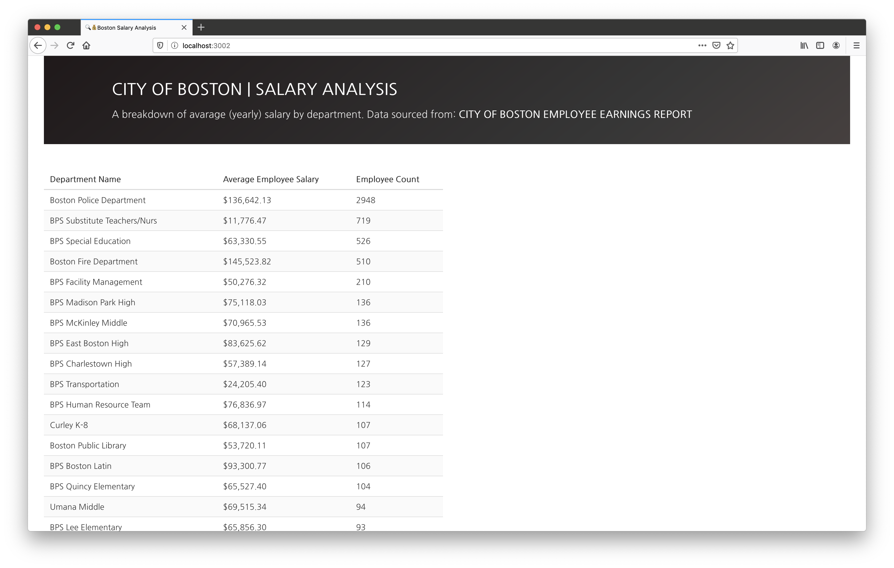

<!-- https://github.com/othneildrew/Best-README-Template -->
<!-- PROJECT SHIELDS -->
[![Issues][issues-shield]][issues-url]

<!-- PROJECT LOGO -->
<br />
<p align="center">
  <a href="https://github.com/tim-corley/city-salary">
    
  </a>

  <h3 align="center">CITY OF BOSTON</h3>

  <h4 align="center">
    Employee Salary Analysis
    <br />
    <br />
    <a href="https://github.com/tim-corley/city-salary"><strong>Go To The Site »</strong></a>
    <br />
  </p>
</p>

<!-- TABLE OF CONTENTS -->
## Table of Contents

* [About](#about-the-project)
  * [Built With](#built-with)
  * [Installation](#installation)
* [Roadmap](#roadmap)
* [License](#license)
* [Contact](#contact)

<!-- ABOUT THE PROJECT -->
## About



The goal of this project is to get familiar and comfortable with retrieving, manipulating, and presenting data from a 3rd party source. Specific areas of focus during this project:
* API queries via SQL statement
* Fetch API & Promises
* Traversing JSON data
* Creating objects
* Various array methods
* DOM manipulation

### Built With

* Data Source: [Analyze Boston](https://data.boston.gov/dataset/employee-earnings-report)
* CSS Framework: [Bulma](https://bulma.io/)
* Google Fonts: [Nanum Gothic](https://fonts.google.com/specimen/Nanum+Gothic?selection.family=Nanum+Gothic)

### Installation

1. Clone the repo
```sh
git clone https://github.com/tim-corley/city-salary.git
```
2. Install NPM packages
```sh
npm install
```
3. Start browser-sync to launch site
```sh
npm run serve
```

<!-- ROADMAP -->
## Roadmap / To-Do

See the [open issues](https://github.com/tim-corley/city-salary/issues) for a list of proposed features and/or improvements (as well as any known issues).

<!-- LICENSE -->
## License

Distributed under the MIT License. See `LICENSE` for more information.

<!-- CONTACT -->
## Contact

Tim Corley | [@tcor215](https://twitter.com/tcor215) |  contact@tim-corley.com

<!-- MARKDOWN LINKS & IMAGES -->
<!-- https://www.markdownguide.org/basic-syntax/#reference-style-links -->
[issues-shield]: https://img.shields.io/github/issues/tim-corley/city-salary?color=red&style=for-the-badge
[issues-url]: https://github.com/tim-corley/city-salary/issues
